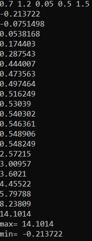
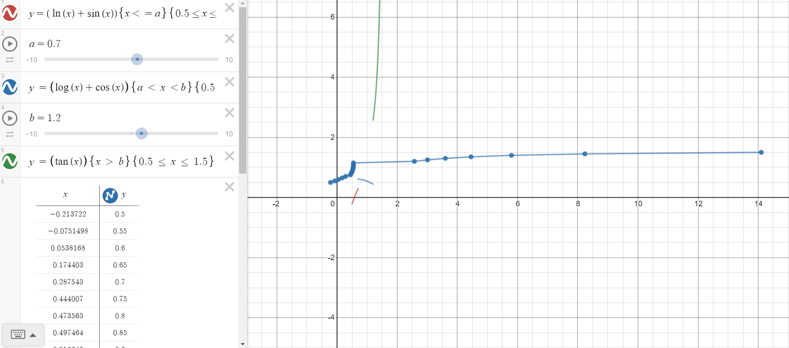

<p text align = "center">МИНИСТЕРСТВО НАУКИ  И ВЫСШЕГО ОБРАЗОВАНИЯ РОССИЙСКОЙ ФЕДЕРАЦИИ</br>
Федеральное государственное автономное образовательное учреждение высшего образования  
"КРЫМСКИЙ ФЕДЕРАЛЬНЫЙ УНИВЕРСИТЕТ им. В. И. ВЕРНАДСКОГО"</br>
ФИЗИКО-ТЕХНИЧЕСКИЙ ИНСТИТУТ </br>
Кафедра компьютерной инженерии и моделирования</br>
<br/><br/>
Отчёт по лабораторной работе № 1<br/> по дисциплине "Программирование"
<br/>
студента 1 курса группы ИВТ 192(2)<br/>
Давкуш Максим Константинович</br>
направления подготовки 09.03.01 "Информатика и вычислительная техника"
<br/>
<table>
<tr><td>Научный руководитель<br/> старший преподаватель кафедры<br/> компьютерной инженерии и моделирования</td>
<td>(оценка)</td>
<td>Чабанов В.В.</td>
</tr>
</table>
<br/><br/>
<p text align = "center">Симферополь, 2019</p>
</br></br>
**Цель:** Овладеть практическими навыками разработки и программирования вычислительного процесса циклической структуры;
Сформировать навыков программирования алгоритмов разветвляющейся структуры;
Изучить операторы ветвления. Особенности использования полной и сокращенной формы оператора if и тернарного оператора.

**Ход работы:**
1. Написание на языке С++ программу, которая для функции f(x) на интервале x ∈ [хнач; xкон]:
- Вывыводит в консоль значения функции f(x) с шагом dx;
- Определяет максимальное и минимальное значение функции.
2. Протабулировать функцию при a = 0.7, b = 1.2, хнач = 0.5, xкон = 1.5, dx = 0.05, записать получившиеся реультаты в отчёт в виде таблицы.
3. Определить минимальное и максимальное значение функции на указанном интервале, занести результаты в отчёт.
4. Построить график функции:
- Добавить на график точки, полученные процессе табуляции.
- Добавить на график точки минимума и максимума с метками значений.
- Вставить скриншот получившегося графика в отчёт.<br>

1. Написание программы для нахождения минимума и максимума функции, а также для нахождение значений функции в точках.</br>

```cpp
#include <iostream>
#include <cmath>
#include <math.h>
#define _USE_MATH_DEFINES


// Возвращаем true, если разница между a и b в пределах процента эпсилона 
bool approximatelyEqual(double a, double b, double epsilon) {
    return fabs(a - b) <= ((fabs(a) < fabs(b) ? fabs(b) : fabs(a)) * epsilon);
}

using std::cout;
using std::cin;

int main() {
    double e = 2.71828, a, b, dx, x0, xn, fx, max = -1.7976931348623158e+308, min = 1.7976931348623158e+308;
    cin >> a >> b >> dx >> x0 >> xn;

    while (!approximatelyEqual(a + dx, x0, 1e-12)) {
        fx = log(x0) + sin(x0);
        if (max < fx) { max = fx; }
        if (min > fx) { min = fx; }
        std::cout << fx << '\n';
        x0 = x0 + dx;
    }

    while (!approximatelyEqual(b, x0, 1e-12)) {
        fx = log(x0) + cos(x0);
        if (max < fx) { max = fx; }
        if (min > fx) { min = fx; }
        cout << fx << '\n';
        x0 = x0 + dx;
    }

    while (!approximatelyEqual(xn + dx, x0, 1e-12)) {
        fx = tan(x0);
        if (max < fx) { max = fx; }
        if (min > fx) { min = fx; }
        cout << fx << '\n';
        x0 = x0 + dx;
    }

    cout << "max= " << max << '\n';
    cout << "min= " << min << '\n';
    return 0;
}
```
<br> 

2. Протабулировать функцию.
Для выполнения табуляция используется функция с условиями:</br>
</img></br>Рис. 1 - Функция с параметрами</br>

Исходные данные:
a = 0.7, b = 1.2; хнач = 0.5, xкон = 1.5; dx = 0.05;
<table>
  <tbody>
    <tr>
      <td>f(x)</td>
      <td>x</td>    
    </tr>
    <tr>
      <td>-0.213722</td>
      <td>0.5</td>  
    </tr>
    <tr>
      <td>-0.0751498</td>
      <td>0.55</td>
    </tr>
      <td>0.0538168</td>
      <td>0.6</td>    
    </tr>
    <tr>
      <td>0.174403</td>
      <td>0.65</td>  
    </tr>
    <tr>
      <td>0.287543</td>
      <td>0.7</td>
    </tr>
       <td>0.444007</td>
      <td>0.75</td>    
    </tr>
    <tr>
      <td>0.473563</td>
      <td>0.8</td>  
    </tr>
    <tr>
      <td>0.497464</td>
      <td>0.85</td>
    </tr>
       <td>0.516249</td>
      <td>0.9</td>    
    </tr>
    <tr>
      <td>0.53039</td>
      <td>0.95</td>  
    </tr>
    <tr>
      <td>0.540302</td>
      <td>1</td>
    </tr>
    <tr>
      <td>0.546361</td>
      <td>1.05</td>
    </tr>
    <tr>
      <td>0.548906</td>
      <td>1.1</td>
    </tr>
    <tr>
      <td>0.548249</td>
      <td>1.15</td>
    </tr>
    <tr>
      <td>2.57215</td>
      <td>1.2</td>
    </tr>
    <tr>
      <td>3.00957</td>
      <td>1.25</td>
    </tr>
    <tr>
      <td>3.6021</td>
      <td>1.3</td>
    </tr>
    <tr>
      <td>4.45522</td>
      <td>1.35</td>
    </tr>
    <tr>
      <td>5.79788</td>
      <td>1.4</td>
    </tr>
    <tr>
      <td>8.23809</td>
      <td>1.45</td>
    </tr>
     <tr>
      <td>14.1014</td>
      <td>1.5</td>
    </tr>
  </tbody>
</table><br>

1. Благодаря написанной программе, мы можем взять максимальное и минимальное значение функции:<br>
fmax=14.1014<br>
fmin=0.00250501<br>

1. Создадим график (Рис. 2) и установим точки на промежуточных значениях, полученных в результате программы, а также установим точки минимума и максимума. Оранжевым цветом обозначены экстремумы, cиреневым - промежуточные значений:</br>
</img>Рис. 2 - График функции</br></br>

**Вывод:** Все цели и задачи лабораторной работы были выполнены в полном объеме. Были получены навыки в построении  графиков, на сайте [desmos](https://desmos.com "desmos"). А также закрепляются знания в работе с markdown , C++.